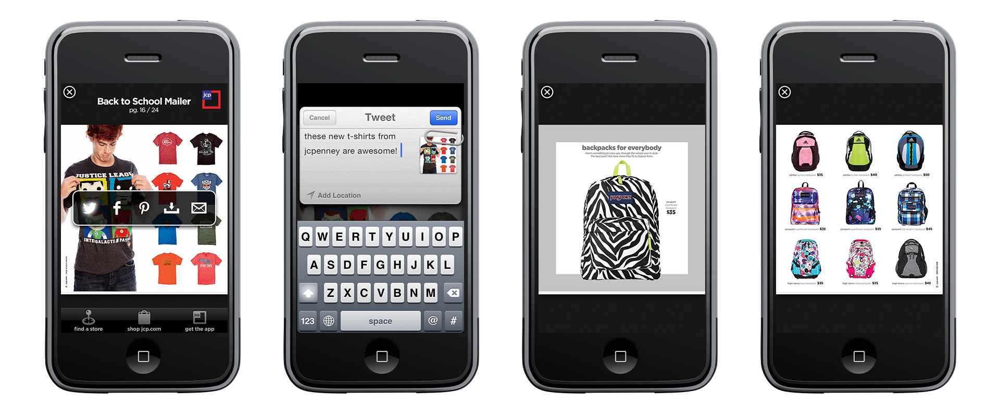

Pitch for a new way JCPenney can stay relevant while advertising on mobile platforms. Taking the popular print catalogs and digitizing them with digital interactions like share buttons, zoomable images and video content.

  <YouTube videoId="IKaM1tsg1wQ?rel=0&enablejsapi=1" />
  <figcaption>Promo video showcasing the ad interactions.</figcaption>

  

---

**Role:** Concept & Design  
**Promo video:** created by Teal Besson 

_c. 2012_