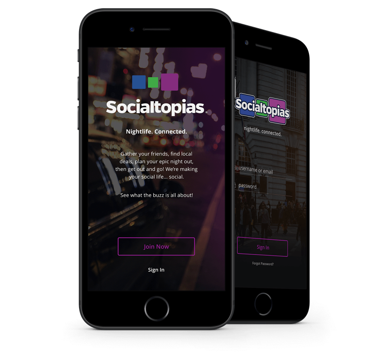

A set of apps to plan your night out. Socialtopians for the users to plan and create their night out. Destinations for the businesses to promote themselves within the Socialtopians app.

My first post using `@narative/gatsby-theme-novela`. Novela is built by the team at [Narative](https://narative.co), and built for everyone that loves the web.

>Based on the work of graphic designers like Leo Peiro ‘Bold’ and Carl Perez Guimarães in the 1960s and 70s, we have embraced this tradition of bold, classic serif typography with a contemporary spin.

---

**Role:** UI/UX Design  
**Crew:** Justin Giardina, John Lambert​​​​​​​

_c. 2016_