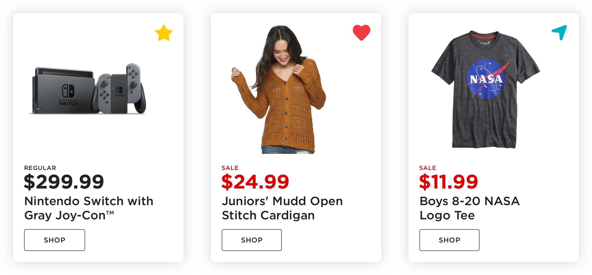
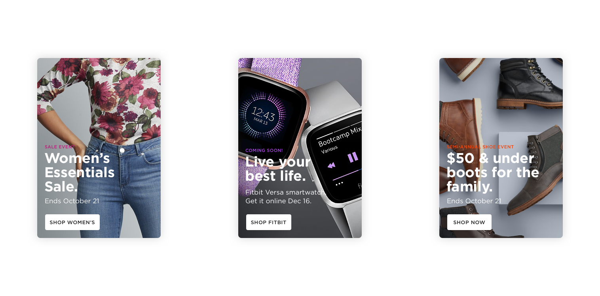

The ask was to develop a scalable visual pattern that will help better present personalized content across channels. The idea of using cards allowed us easier cross channel delivery, enhanced personalization, smarter curation and amplified localization.

These are the results.

We exhaust millions of impressions by delivering the right content to the wrong audience, making the content ultimately irrelevant. These opportunities could easily be redeemed by developing a presentation pattern that makes serving hyper-relevant content easier to deploy.

  

Story Cards—An entry point into a deeper level of engagement with a product, brand, or seasonal topic.

  

Product cards — Simplified pricing views allows us to display ratings, a favorites toggle, or local availability.

  

List cards — Quick glances of lists seamlessly guide users back into their experience.

  

Customers are possessive not only of their style identity, but also of their own curation and collection process. A new card-based design approach will allow customers to truly collect and keep their style.​​​​​​​

---

**Role:** Art Direction & Design  
**Creative Director:** David Waggoner

_c. 2018_